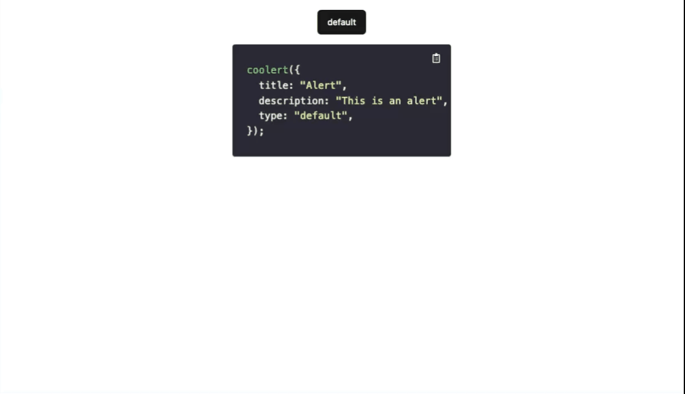

# Coolert

A lightweight alert and confirm library for reactjs and nextjs using Shadcnui. Alert and confirm library for reactjs in single-line of code

## Preview



## Getting Started

```bash
yarn add coolert
```

## Usage

### coolert

Alert component

```bash
 coolert({
  title: 'Alert',
  description: 'This is description',
  type: 'info',
 });
```

### Coolfirm

Confirm component

```bash
 coolfirm({
   title: 'Confirm',
   description: '',
   type: 'info',
   onConfirm: (value) => {
         console.log("Confirm: ", value);
      },
   onCancel: () => {
         console.log("Cancel");
      },
   });
```

## Theme

You can config it using [shadcnui theme](https://ui.shadcn.com/themes). Coolert will adapt your theme to shadcnui.

## Built With

- [Vite](https://vitejs.dev/) - The web framework used

## Contributing

Please read [CONTRIBUTING.md](https://gist.github.com/PurpleBooth/b24679402957c63ec426) for details on our code of conduct, and the process for submitting pull requests to us.

## License

This project is licensed under the MIT License - see the [LICENSE.md](LICENSE.md) file for details
